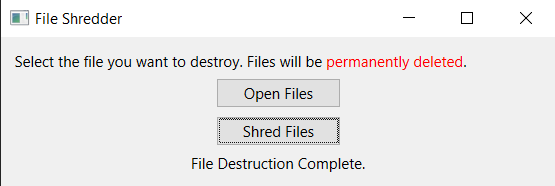

# file-shredder-gui-app
PyQt6 GUI App to mass shred/destroy files

1. Make sure to install PyQt6 package from pip.
2. Run main.py
3. Click on "Open Files" and select the files you want to destroy.
4. Confirm destruction by clicking on "Shred Files".
